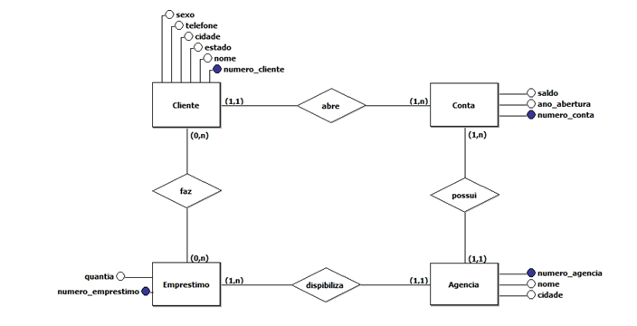

- Emprestimo(<u>numero_emprestimo</u>, quantia, **numero_agencia**)
  - numero_agencia referencia Agencia
- Cliente(<u>numero_cliente</u>, nome, estado, cidade, telefone, sexo)
- Agencia(<u>numero_agencia</u>, nome cidade)
- Conta(<u>numero_conta</u>, ano_abertura, saldo, **numero_cliente**, **numero_agencia**)
  - numero_cliente referencia Cliente
  - numero_agencia referencia Agencia
- Emprestimo_Cliente(**<u>numero_cliente</u>**, **<u>numero_emprestimo</u>**)
  - numero_cliente referencia Cliente
  - numero_emprestimo referencia Emprestimo

